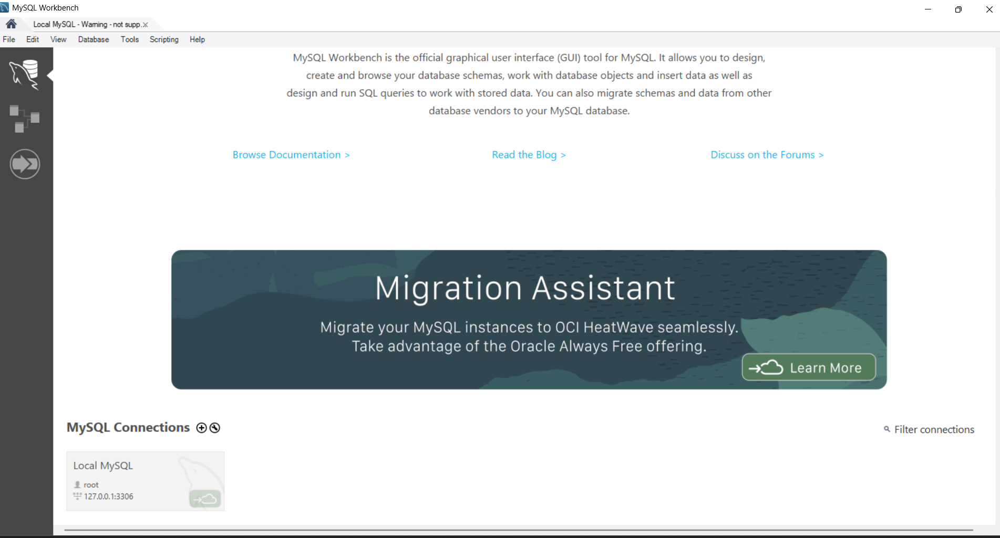
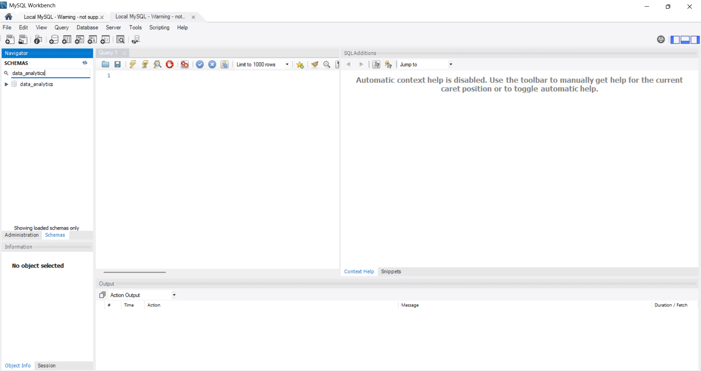
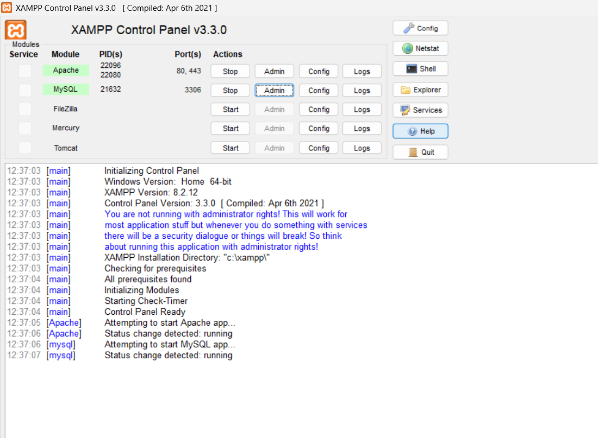
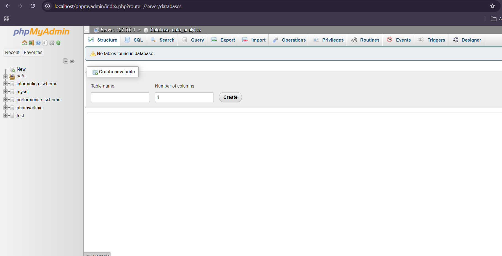

# what is DBMS ? 

1. DBMS stands for database management systems 
2. DBMS manage databases using its GUI 
3. DBMS mysqlCommunity 

# install mysQLworkbench8.0

1. download mysqlWorkbench8.0
2. start via start menu 
3. create an database instance 
4. create an database instance 




5. how to create database in mysqlWorkbench 

6. **syntax**

```
create database data_analytics_4pm

```



# install xampp 

1. xampp download 
2. install xampp 
3. open xampp control panel 
4. start control panel of xampp

**https://www.apachefriends.org/download.html**

5. start xampp server 





6. start database in xampp 




# what is RDBMS ?

 1. RDBMS stands for relational database management systems 
 2. RDBMS provides relationahsip b/w database 
 3. RDBMS normalised database 
 4. RDBMS provides instance of databases 


or 

