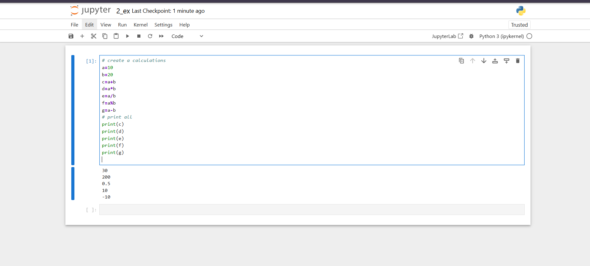
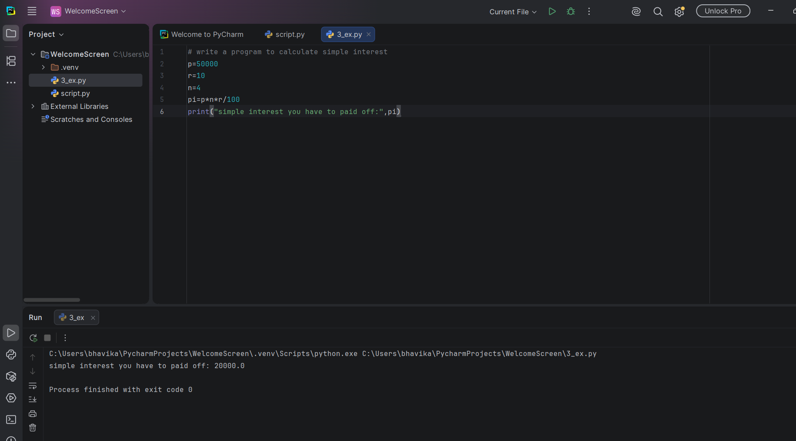

 # what is python ? 
1. python is a high level language
2. python is also high level interpreted based programming language
3. python provides simple syntax 
4. it will be created by Guido van rossum by first released feb 1991 

## definition ..

```
python is a high-level interpreted , object oriented programming language used to developed software | websites | automation | data analytics | artificial intelligence systems and many more types of programmes there we used python.

```
# what is interpreter and compiler ? 
1. interpreter is used to execute and check step by step programmes and convert high level language to low level language.

2. compiler is used to execute and check step by step programmes and convert high level language to low level language.


## advantages of python 

1. **easy to learn** : easy and simple language
2. **free or open source** : free download and used
3. **python is support cross plateform**  : support all OS 
4. **large and many more packages and libraries support**: python are support many more languages and lib and packages 
5. **huge numbers of lib and framework support**
6. **support multiple programming style**
7. **automatic memory manage**
8. **rapid and fast development**
9. **create many programming software and website and automation app**
10. **large community**

## where we used python ? 
1. python used in Web development
   **django**
2. python used in software development
   **tkinter**
3. Artificial intelligence 
4. Data science 
5. data analytics 
6. Game development 
7. cyber security 
8. Networking 
9. web scraping 
10. computer vision
11. DevOps
12. Robotics 
13. Automation


# how to run and install python ? 
  ```
  https://www.python.org/downloads/

  There are two method to run python 
  1) script method 
  2) REPL (read | evaluate | print | loop) method 
  
  ```

# script method : 
1. create a file an save it with .py 
2. and run via interpreter 
3. examples.py

```
name='hi i am bhavika'
print(name)

```

# REPL or read evaluate print and loop
1. open cmd 
2. write py and enter

```
Python 3.14.7 (tags/v3.14.7:823f032, Aug  5 2026, 10:51:32) [MSC v.1944 64 bit (AMD64)] on win32
Type "help", "copyright", "credits" or "license" for more information.
>>> name="bhavika"
>>> print(name)
bhavika
>>> a=10
>>> b=20
>>> c=a+b
>>> print(c)
30
>>>

or

Python 3.14.6 free-threading build (tags/v3.14.6:c63aec6, Jun 10 2026, 10:26:35) [MSC v.1944 64 bit (AMD64)] on win32
Type "help", "copyright", "credits" or "license" for more information.
>>> name=input("Enter your name :")
Enter your name :bhavika
>>> print(name)
bhavika
>>>
```

# how to install jupyter and run python programmes on jupyter ?

1. jupyter is a tools or IDE 
2. install jupyter 
3. pip install jupyter 
4. jupyter notebook

```
>pip show jupyter
Name: jupyter
Version: 1.1.1
Summary: Jupyter metapackage. Install all the Jupyter components in one go.
Home-page: https://jupyter.org
Author: Jupyter Development Team
Author-email: jupyter@googlegroups.org
License: BSD
Location: C:\Users\bhavika\AppData\Local\Programs\Python\Python314\Lib\site-packages
Requires: ipykernel, ipywidgets, jupyter-console, jupyterlab, nbconvert, notebook
Required-by:

or

create a file in jupyter via 2-examples.ipynb

# create a calculations
a=20
b=10
c=a+b
d=a-b
e=a/b
f=a%b
g=a*b
#print all
print(c)
print(d)
print(e)
print(f)
print(g)

```



## how to run python using pycharm 
1. pycharm is simple IDE specially built for python 
2. pycharm also created file in .ipynb and .py 
3. pycharm create a inbuilt projects of python or .VENV or virtual environment




# what is operator in python ?

1. operator is usd to operand some action there we used operator 
2. operator is used to perform some action there we used operator 

## types of operator ? 

1. **airthematic operator** :

```
performed some airtmatic expression there we used airtmatic operator 
examples : + ,  - , * , / , % etc
```

2. **assingment operator** :

```
where we assign some values  
examples : =, ==, , != etc
```


3. **comparision operator** :

```
where we assign and compare values  
examples : === , > , < , >= , <= etc
```

4. **bitwise operator** :

```
it is also called sorthand operator  
examples : +=, -=, *=, /=, %=  etc
```

5. **logical operator** :

```
logical operator is used to check two values if condition is true and if one is true or false or 
examples: and , or , not  etc
``` 

6. **increment/decrement operator**

```
increment / decrement 

examples : ++ , --
         : i+=i # i=i+1
         : i++

```

7. **string concatenate operator**

```
examples : + 

```

# what is  variables in python ? 

1. A variables is stored some information about data ie. called variables 
2. A variables is just like container where we stored information about data i.e called variables 
3. A variables is assign in python via character but not via reserved keyword 

**examples**

```
a=10
name='abc'
abc=10.6565
b=20.6565

print(a)
print(abc)
print(b)


```
**examples of resrved keyword**

```
import keyword
print(keyword.kwlist)
```

**list of reserved keyword**
```
['False', 'None', 'True', 'and', 'as', 'assert', 'async', 'await', 'break', 'class', 'continue', 'def', 'del', 'elif', 'else', 'except', 'finally', 'for', 'from', 'global', 'if', 'import', 'in', 'is', 'lambda', 'nonlocal', 'not', 'or', 'pass', 'raise', 'return', 'try', 'while', 'with', 'yield']
 
``` 

# rules of variables 

1. reserved keyword does not work in variables
2. white space not accepted in variables 
3. start with numbers can not be accepted in variables  

```

ab=10
abc=10.5656
name='abc'
_a=10


```

# how to check data types of variables 

# print a data types of variables 
```

# print a dtatypes of variables
a=10.05
print(a)
print(type(a))

a=10
print(a)
print(type(a))

name='abc'
print(name)
print(type(name))

```
# what is repl in python?

1. repl stand for read| evalute | print | loop
2. repl create python programs without create script.
3. repl stands to evalute program without write an script or create module in python.
4. repl not provide file backup because run on command line interface

**examples of repl**
```
>>> a=10
>>> b=20
>>> c=a+b
>>> print("additions of numbers:",c)
additions of numbers: 30
>>> name=input("enter your name:")
enter your name:bhavika
>>> print("my name is:",name)
my name is: bhavika
>>> a=int(input("enter a value:"))
enter a value:20
>>> b=int(input("enter b value:"))
enter b value:40
>>> c=a+b
>>> print("additions of numbers:",c)
additions of numbers: 60
>>> age=18
>>> if age>=18:
...     print("i am eligible for vote")
... else:
...     print("i am not eligible for vote")
...
i am eligible for vote
>>> for i in range(1,100):
...     print(i)
...
1
2
3
4
5
6
7
8
9
10
11
12
13
14
15
16
17
18
19
20
21
22
23
24
25
26
27
28
29
30
31
32
33
34
35
36
37
38
39
40
41
42
43
44
45
46
47
48
49
50
51
52
53
54
55
56
57
58
59
60
61
62
63
64
65
66
67
68
69
70
71
72
73
74
75
76
77
78
79
80
81
82
83
84
85
86
87
88
89
90
91
92
93
94
95
96
97
98
99
>>>
```


  